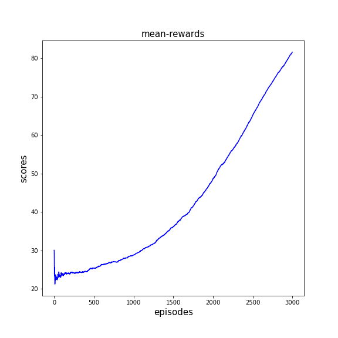
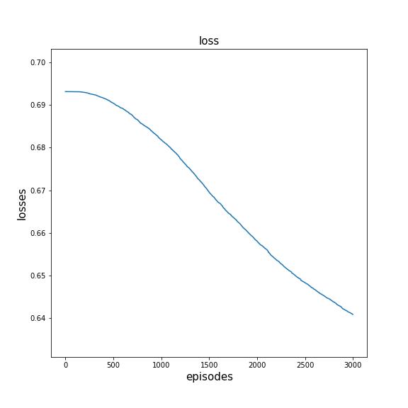

# Policy Gradient(REINFORCE方法)

环境：Tensorflow2.3、Gym、numpy

model中存放的是训练好的模型

data中保存的是代码执行中的数据，以.npy的格式保存

graph中保存的是绘制的图形

PG.py是PolicyGradient的模型

cartpole_v0_pg.py是利用PG模型在CartPole_v0环境下训练和测试

draw_graph.ipynb是根据data绘图的代码

训练时平均回报：

训练时的损失：

